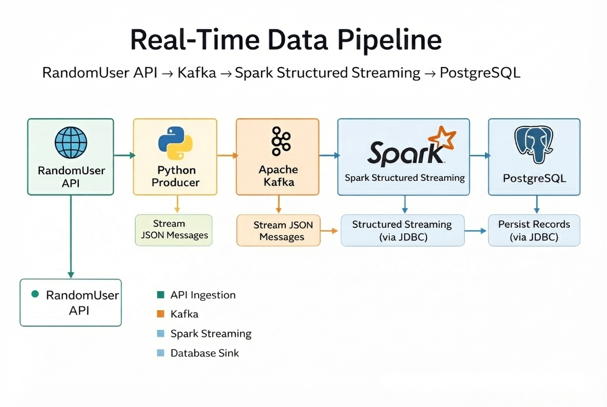

# 🚀 Real-Time Data Engineering Pipeline
### RandomUser API → Kafka → Spark Structured Streaming → PostgreSQL

> **Production-style, end-to-end streaming pipeline** that ingests live data, processes it in real time, and persists clean, validated records for analytics.

---

## 🌟 Overview

This repository contains a **complete real-time data pipeline** designed to simulate
a production-grade Data Engineering system. The pipeline ingests live user data from
a public API, streams it through **Apache Kafka**, processes it using **Apache Spark
Structured Streaming**, and stores the results in **PostgreSQL**.

The project emphasizes **reliability, scalability, and fault tolerance**, covering
real-world concerns such as malformed data, schema validation, checkpointing, and
JDBC configuration.

---

## 🧠 Pipeline Architecture

### High-Level Flow

RandomUser API  
→ Python Producer  
→ Apache Kafka  
→ Spark Structured Streaming  
→ PostgreSQL

### Architecture Diagram

📌 **Add your pipeline drawing here**



> This diagram illustrates the full data flow from ingestion to persistence.

---

## 🛠️ Tech Stack

| Layer | Tool |
|------|------|
| Data Source | RandomUser Public API |
| Ingestion | Python Kafka Producer |
| Messaging | Apache Kafka |
| Processing | Apache Spark Structured Streaming |
| Storage | PostgreSQL |
| Connectivity | JDBC |
| Environment | Linux Virtual Machine |

---

## 📂 Repository Structure

```text
.
├── randomuser_producer.py
├── spark_randomuser_to_postgres.py
├── README.md
├── screenshots/
│   ├── pipeline-architecture.png
│   ├── kafka.png
│   ├── producer-running.png
│   ├── spark-streaming.png
│   └── postgres-table.png
└── .gitignore
```

## How to Run

### 1️⃣ Start Zookeeper

```javascript
zkServer.sh start

```
### 2️⃣ Start Kafka Broker

```javascript
kafka-server-start.sh config/server.properties

```
### 3️⃣ Create Kafka Topic

```javascript
kafka-topics.sh --create \
--topic randomuser-topic \
--bootstrap-server localhost:9092 \
--partitions 1 \
--replication-factor 1
```
### 4️⃣ Run the Producer (API → Kafka)

```javascript
python3 randomuser_producer.py

```
### 5️⃣ Run Spark Structured Streaming

```javascript
spark-submit \
--packages org.apache.spark:spark-sql-kafka-0-10_2.12:3.0.1 \
--jars postgresql-42.2.18.jar \
spark_randomuser_to_postgres.py


```
### 6️⃣ Verify Data in PostgreSQL

```javascript
SELECT * FROM users LIMIT 10;
```


## 🛡️ Data Quality & Reliability

The pipeline is designed with production-level reliability in mind: 

→ Filters malformed or invalid Kafka messages. 

→ Excludes records with missing critical fields.

→ Uses Spark checkpointing for fault tolerance and recovery .

→ Explicit JDBC driver configuration.

→ Proper database authentication and connection handling.

## ✅ Output

✔ Continuous real-time ingestion.

✔ Structured stream processing using Spark.

✔ Clean and validated data stored in PostgreSQL.

✔ Production-like streaming behavior.

## 🎯 Key Learnings

Designing real-time streaming pipelines

Kafka producer and topic management

Spark Structured Streaming internals

Micro-batch processing with foreachBatch

JDBC integration with streaming jobs

Debugging and stabilizing streaming systems


## Author

- [@Rabha Gharib](https://github.com/RabhaGharib972)

